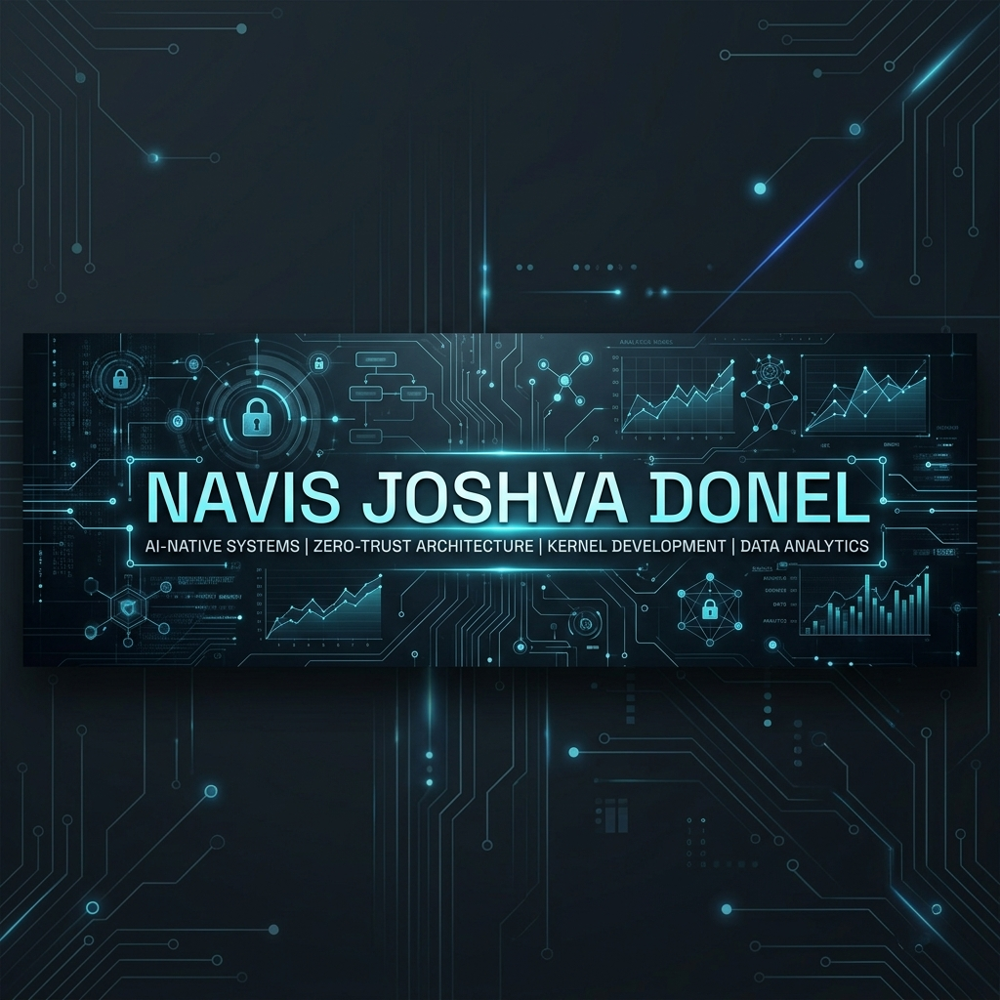

# 
Navis Joshva Donel J

  

  
  
  

---

### 🚀 About Me

I am a **Data Engineer & AI-Native Systems Developer** passionate about building intelligence layers and secure, high-performance operating systems. My work bridges the gap between **Agentic Development**, **Deep Data Analytics**, and **Low-Level System Architecture**.

- 🤖 Currently building **Agent-Snow**, a local-first intelligence layer.
- ❄️ Architecting **Snow OS**, an AI-native operating system focused on Zero-Trust security.
- 📊 Specialized in transforming complex datasets into actionable insights using **Power BI** and **Python**.

---

### 🛠️ Tech Stack & Skills

<table align="center">
  <tr>
    <td align="center" width="33%">
      <b>Languages</b>  
      
      
      
      
    </td>
    <td align="center" width="33%">
      <b>Data & AI</b>  
      
      
      
      
    </td>
    <td align="center" width="33%">
      <b>Systems & DevOps</b>  
      
      
      
      
    </td>
  </tr>
</table>

---

### 🌟 Featured Projects

#### 🧠 [Agent-Snow](https://github.com/navisjoshvadonel/Agent-Snow)
> A local-first intelligence layer designed for high-performance agentic workflows. Focuses on privacy-preserving AI interactions and seamless tool integration.

#### ❄️ [Snow OS (DeploySnowos)](https://github.com/navisjoshvadonel/DeploySnowos)
> An AI-Native Zero-Trust Operating System. Built with a focus on security by design, featuring custom kernel-level optimizations for AI workloads.

#### 📊 [Data Exploration & Visuals](https://github.com/navisjoshvadonel/DATA-EXPLORATION-AND-VISUALS)
> A comprehensive portfolio of data analysis projects using Power BI, R, and Python. Features complex dashboard designs and deep statistical exploration.

---

### 📈 GitHub Insights

  

  
  

  

  

---

### 🤝 Let's Connect!

- 📧 Email: [navis.donel_bai28@mepcoeng.ac.in](mailto:navis.donel_bai28@mepcoeng.ac.in)
- 💼 LinkedIn: [Navis Joshva Donel J](https://linkedin.com/in/navisjoshvadonel)
- 🌐 Portfolio: [Data Exploration & Visuals](https://github.com/navisjoshvadonel/DATA-EXPLORATION-AND-VISUALS)

  <i>"Building the future, one agent at a time."</i>

